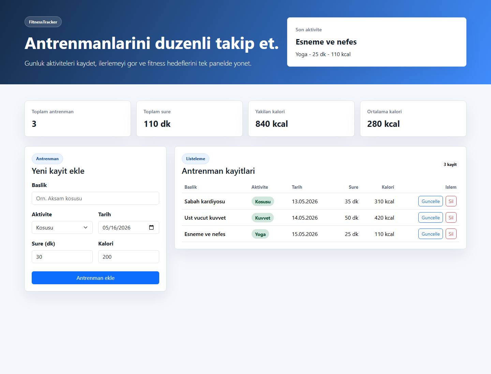

# FitnessTracker

FitnessTracker, React ve Bootstrap 5 ile hazırlanmış basit bir fitness takip uygulamasıdır. Kullanıcı antrenman ekleyebilir, kayıtları listeleyebilir, güncelleyebilir ve silebilir.

## Kullanılan Teknolojiler

- React
- Vite
- Bootstrap 5
- Netlify

## Proje Yapısı

- `src/Components`: Form, liste ve istatistik bileşenleri
- `src/Pages`: Sayfa bileşenleri
- `src/Interfaces`: Veri modeli ve başlangıç verileri

## Özellikler

- Antrenman ekleme
- Antrenmanları listeleme
- Var olan kaydı güncelleme
- Kayıt silme
- Toplam süre, kalori ve ortalama kalori özetleri
- Kayıtları tarayıcının localStorage alanında saklama

## Ekran Görüntüsü



## Kurulum

```bash
npm install
npm run dev
```

## Build

```bash
npm run build
```

Netlify için build komutu `npm run build`, yayın klasörü `dist` olarak ayarlanmıştır.

## Teslim Notları

1. Projeyi GitHub'da public bir repository olarak yayınlayın.
2. Netlify'da repository'yi bağlayın.
3. Build komutu olarak `npm run build`, publish directory olarak `dist` kullanın.
4. GitHub ve Netlify linklerini proje teslim formuna ekleyin.
